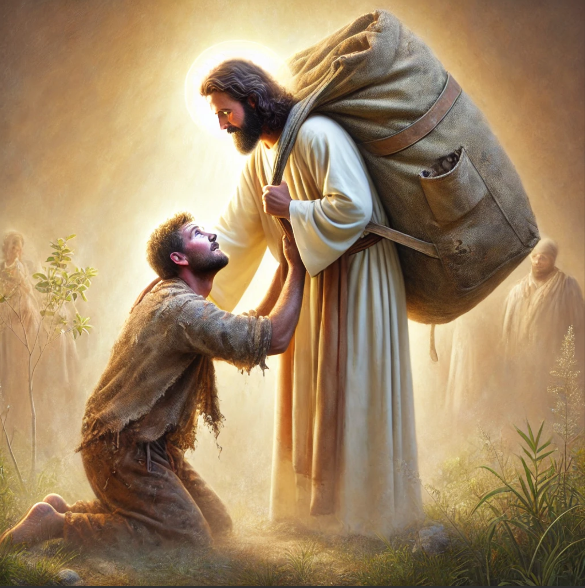

# Gen 2:3 The Seventh Day

> Gen 2:3 \
> 3 So God blessed the seventh day and made it holy, \
because on it God rested from all his work that he had done in creation

## Fulfillment

Christ's ministry completed the total work of creation itself (past tense and future tense - in Christ) at the cross which gives rest to believers.
Why? Because we are no longer under the law, but under grace.
Christs work in fulfilling the law sets us free from its constant demand.
We can rest in Him for He has accomplished it.

> Matt 11:28-30 \
> 28 Come to me, all who labor and are heavy laden, and I will give you rest. \
29 Take my yoke upon you, and learn from me, for I am gentle and lowly in heart, and you will find rest for your souls. \
30 For my yoke is easy, and my burden is light.”

Christ as God in the flesh is Lord of the Sabbath. 
This is a direct claim to being the author (God) of the Sabbath and the very reason why the Pharisees conspired against him, to destroy him.

> Matt 12:6-8 \
> 6 I tell you, something greater than the temple is here. \
7 And if you had known what this means, ‘I desire mercy, and not sacrifice,’ you would not have condemned the guiltless. \
8 For the Son of Man is lord of the Sabbath.” 

